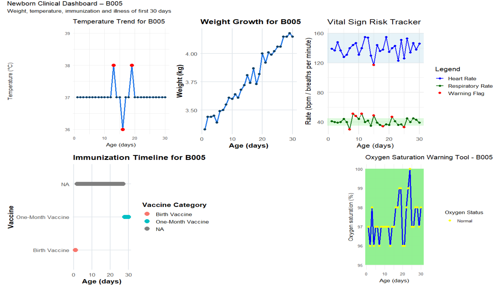

# 🩺 30-Day Newborn Health Monitoring System

## 📌 Project Overview
This project focuses on designing and analyzing a **data-driven health monitoring system for newborns during their first 30 days of life**.  
The system supports structured data collection, analysis, and visualization to assist healthcare monitoring and decision-making.

The project demonstrates how **SQL-based databases, analytics, and dashboards** can be used to track early-life health indicators in a safe and ethical manner.

---

## 🎯 Objectives
- Design a relational database for newborn health monitoring
- Track key indicators such as vitals, illnesses, and immunization status
- Perform analytical queries to identify health trends
- Support evidence-based decision-making using data

---

## 🗂️ Data Description
The dataset represents anonymized information collected during the **first 30 days of life**, including:
- Basic newborn identifiers (non-PII)
- Daily vital signs
- Illness occurrences
- Immunization events

⚠️ No personally identifiable information (PII) is included.

---

## 🧱 Database Design
he database schema follows a normalized relational design centered on the `babies` table, 
with daily monitoring tables linked via foreign keys. This structure supports longitudinal 
analysis of newborn health indicators over the first 30 days of life.

The database follows **relational design principles** with:
- Primary and foreign keys
- One-to-many relationships
- Normalized tables to reduce redundancy

Example tables include:
- `newborn babies informtaion`
- `daily vitals information`
- `illness records`
- `immunizations record`

---
## 📊 Clinical Analytics Dashboard

The dashboard summarizes key newborn health indicators over the first 30 days of life,
including temperature, weight growth, vital signs, immunization timeline, and oxygen
saturation. Warning flags highlight potential clinical risks requiring attention.

## 🧮 Methods & Tools
**Technologies used:**
- **SQL** — database design and analytical queries  
- **R** — data analysis and visualization  
- **Power BI** — dashboard creation  
- **GitHub** — version control and documentation  

---

## 📊 Key Analyses
- Trends in newborn vital signs over time
- Frequency and timing of illness events
- Immunization coverage during the neonatal period
- Summary indicators for monitoring outcomes

---

## 📁 Repository Structure

---
newborn-health-monitoring-30-days/
│
├── data/        # Sample or anonymized datasets
├── sql/         # Database schema and SQL queries
├── analysis/    # R or Python scripts
├── figures/     # Charts, dashboards, screenshots
├── reports/     # Final project report (PDF)
└── README.md    # Project documentation

## 📌 Results & Insights
This project demonstrates how structured data systems can:
- Improve early detection of health risks
- Support consistent monitoring practices
- Enable scalable health data analysis in low-resource settings

---

## 🔒 Ethics & Privacy
- All data is anonymized
- No real patient identifiers are shared
- Project is for **educational and analytical purposes only**

---

## 👤 Author
**Adolphe Cyusa**  
Graduate student & data analytics professional  
Interests: Health analytics, development data systems, GIS-driven decision-making

